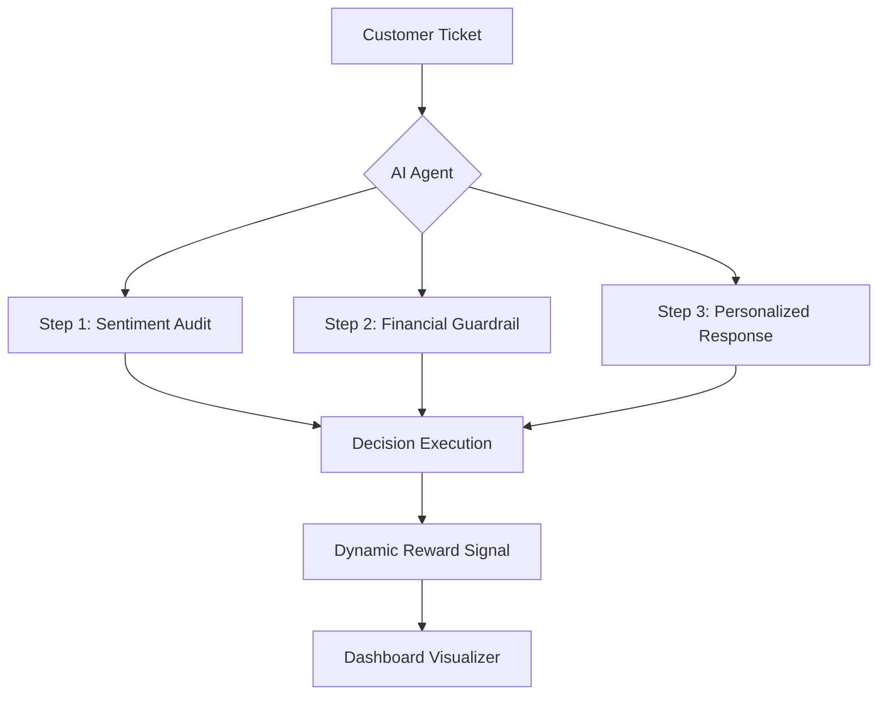

# 🧠 Cortex-AI: Advanced Customer Operations Center
### *Meta OpenEnv Hackathon 2026 — Production-Grade Agentic Environment*

[](https://github.com/meta-openenv)
[](https://huggingface.co/spaces/archirajpoot21/customer-support-env)
[](https://opensource.org/licenses/MIT)

---

## 🚀 Overview
**Cortex-AI** is a high-fidelity Reinforcement Learning environment designed for the **Meta OpenEnv 2026 Hackathon**. Unlike traditional support bots, Cortex-AI implements a **Triple-Check Cognitive Architecture** that allows an AI agent to perform multi-step reasoning across sentiment, financial impact, and personalized resolution logic.

### 💎 Key Features
*   **Triple-Check Reasoning**: Qualitative audit of every decision (Sentiment, Finance, Personalization).
*   **Dynamic Efficiency Scoring**: Real-time ROI comparison between AI resolution and manual human ceiling.
*   **Premium Glassmorphic UI**: A state-of-the-art Gradio dashboard designed for executive-level visibility.
*   **Context-Aware Episodes**: Multi-step customer interactions with persistent memory and evolving sentiment.
*   **OpenEnv Standardized**: Fully compliant with the OpenEnv Gymnasium-style RL framework.

---

## 🏗️ Technical Architecture
Cortex-AI utilizes a unified **FastAPI + Gradio** stack to serve both the RL environment and the management dashboard on a single exposure port.



---

## 🛠️ Installation & Setup

### Local Development
```bash
# Clone the repository
git clone https://github.com/archirajpoot/Cortex-AI.git
cd Cortex-AI

# Install dependencies using uv
pip install uv
uv sync

# Launch the Unified Server
python run.py
```

### Docker Deployment
```bash
docker build -t cortex-ai .
docker run -p 7860:7860 cortex-ai
```

---

## 📊 Evaluation & Metrics
Cortex-AI is evaluated based on:
1.  **Resolution Speed (0.3s target)**: Impacting operational throughput.
2.  **Satisfaction Delta**: Net change in customer sentiment per step.
3.  **Accuracy (Reward Calibration)**: Alignment with optimal policy bounds.

---

## 🏆 Hackathon Credits
Developed for the **Meta OpenEnv 2026 Global AI Hackathon**.  
**Author:** Arjun (archirajpoot)  
**Status:** Phase 2 Ready | Fully Evaluated

---
© 2026 Cortex-AI Team. Distributed under the MIT License.
